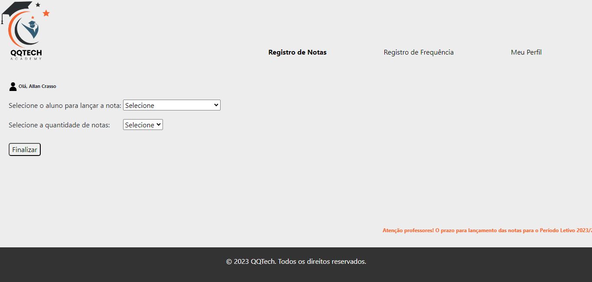
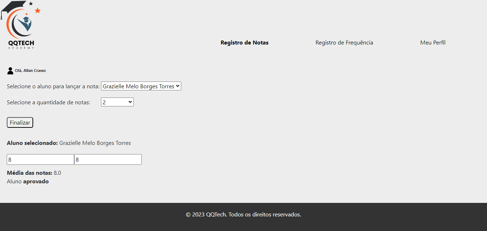
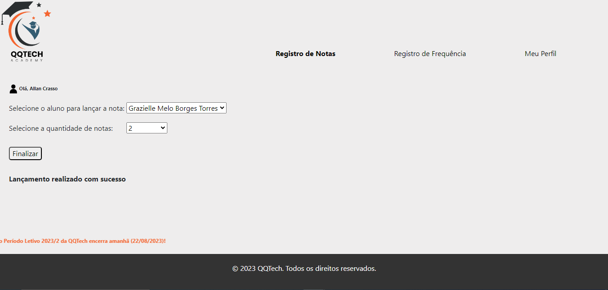

## TAREFA

<p style="text-align:justify">Faça um menu de opções, onde o usuário poderá determinar quantas notas ele deseja informar. As opções são: duas notas, três notas e quatro notas. Dependendo da escolha do usuário, deverão ser coletadas quantidades de notas distintas e o cálculo da média deverá ser modificado. Além disso a solução deverá apresentar o nome do aluno. </p>

## SOLUÇÃO

<p align="center">

</p>

## ARQUITETURA

```
📁QQTECH-ACADEMY
|
|- 📁 assets
| |- 📑 icone-perfil.png
| |- 📑 logotipo.png
| |- 📑 tela-cadastro-nota.png
| |- 📑 tela-finalizar-cadastro.png
| |- 📑 tela-notas.png
|
|- 📁 css
| |- 📑 index.css
|
|- 📁 js
| |- 📑 index.js
|
|- 📑 index.html
|- 📑 README.md
```

<p>Tela para cadastro de notas QQTech Academy:</p>

<p>Tela simulando cadastro de nota e resultado de aprovação:</p>

<p>Tela simulando a finalização do cadastro:</p>


<br><br>
<a href="https://github.com/MBTGrazielle/academy-QQTech" target="_blank"></a>
